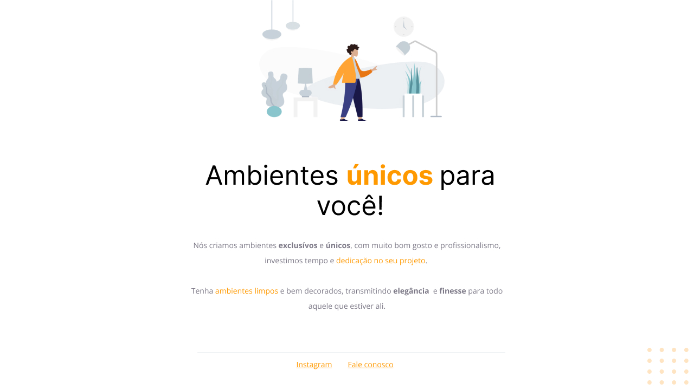
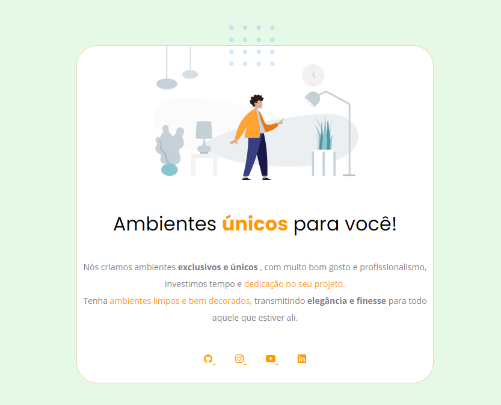

<h1 align="center"> MoveisCustomizados </h1>

Programa exclusivo e gratuito, promovido pela Rocketseat para ensino de tecnologias WEB.  

  <a href="#-tecnologias">Tecnologias</a>&nbsp;&nbsp;&nbsp;|&nbsp;&nbsp;&nbsp;
  <a href="#-projeto">Projeto</a>&nbsp;&nbsp;&nbsp;|&nbsp;&nbsp;&nbsp;
  <a href="#-layout">Layout</a>&nbsp;&nbsp;&nbsp;|&nbsp;&nbsp;&nbsp;
  <a href="#memo-licença">Licença</a>

  

 

## Esboço do Projeto

  
 

## Minhas alterações

  

## 🚀 Tecnologias

Esse projeto foi desenvolvido com as seguintes tecnologias:

- HTML e CSS
- Git e Github
- Figma

## 💻 Projeto

O Moveis Customizados é um desafio feito no stage 02 do explore da Rocketseat

- Assine já. e não fique de fora dessa jornada!

## 🔖 Layout

Você pode visualizar o layout do projeto através [DESSE LINK](https://www.figma.com/file/ZE0tvsZGs7htnQmQpJDIdS/Explorer---Projeto-01-(Copy)?node-id=1%3A2&t=5jN5P6XLfNKay1OL-0). É necessário ter conta no [Figma](https://figma.com) para acessá-lo.

## :memo: Licença

Esse projeto está sob a licença MIT.

---

Feito com ♥ by Damara Lucena/RocketSeat :wave: [Participe da nossa comunidade!](https://discord.gg/rocketseat)
